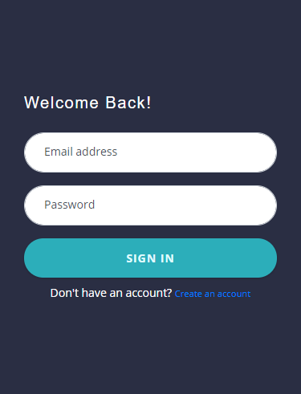
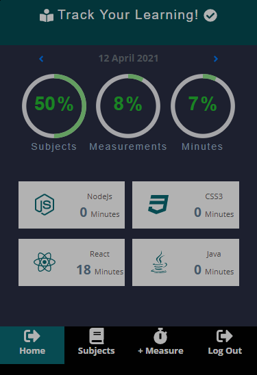
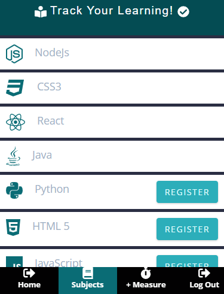
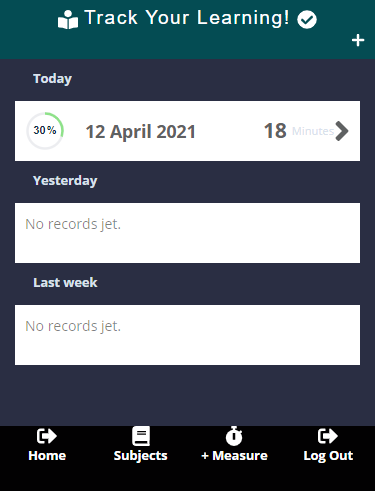

# README

 

# Final Capstone Project: Tracking App

Final Capstone Project of the Microverse Technical Curriculum Program, this project is a fullstack application consists in a frontend Single Page Application built with React/Redux, the application consumes an API built with Ruby On rails on the backend. The application is serves to help users track their learning progress daily; It helps users to determine which subject ot learn more and also motivates them to learn more when they see their progress as it is being tracked.

​
>    
>

## Link to Live Demo:

[Learning Trackify](https://frozen-wildwood-96033.herokuapp.com)

### Project Specification

- Users can log into the app and create an account.
- The user is presented with a list of courses or subject that can be measured.
- The user selects a course to measure and is presented with a page to introduce the measurement (and timestamp).
- The user can access a list of courses with measurements and check the progress of it within time

- The user can edit and delete measurements.

### Built With

- Node.js
- React
- React-DOM
- React-Create-App
- Redux
- npm
- CSS
- ES6
- eslint
- stylelint
- Jest
- React Testing library
- Ruby and Rails
- Postgresql
- Rspec
- bcrypt
- Heroku
- HTML, CSS

## Prerequisities

To get this project up and running locally, you must have ruby, sqlite3, postgress, yarn, create-react-app and node installed on your computer.npm

## Getting Started
To get a local copy up and running follow these steps:

### Setup

**Step 1** 
Navigate through the local folder where you want to clone the repository and run
`git clone https://github.com/uimarshall/learning-trackify-1.0`. 

**Step 2** 
Run `cd learning-trackify-1.0`. 

**Step 3** 
Run `bundle install` to install the gems from the `Gemfile`. 

**Step 4** 
Run `yarn install` to install the packages from the `package.json` file. 

**Step 5** 
Run `rake db:create` to create your local database.

**Step 6** 
Run `rake db:migrate` to migrate your local database.

**Step 7** 
Run `rake db:seed` to migrate your local database.

**Step 8** 
Run `rails s -p 3001` to start the rails server.

**Step 9** 
Run `yarn --cwd client start` to start the react frontend.

**Step 10** 
Run the app in the development mode.\
Open [http://localhost:3000](http://localhost:3000) to view it in the browser.

The page will reload if you make edits.\
You will also see any lint errors in the console. 

### To Fix linting errors

- Run `npm run lintfix`
## Testing

Frontend (React)

- cd into `learning-trackify-1.0` folder
- cd into `client` folder

- Run `npm test`

Backend (Rails)

- cd into `learning-trackify-1.0` folder
- Run `bundle exec rspec`

 ### Deployment

- Sign up on Heroku
- follow instruction to deploy on the Heroku: [Deploy on Heroku](https://medium.com/how-i-get-it/rails-react-js-heroku-deployment-43d7469e122e).
## Authors
#### 👤 **Marshall AKPAN**

- Github: [@uimarshall](https://github.com/uimarshall)
- Twitter: [@uimarshall](https://twitter.com/uimarshall)
- Linkedin: [uimarshall](https://www.linkedin.com/in/marshall-akpan-19745526/)

​
## 🤝 Contributing

Our favourite contributions are those that help us improve the project, whether with a contribution, an issue, or a feature request!

Feel free to check the [issues page](https://github.com/uimarshall/learning-trackify-1.0/issues) to either create an issue or help us out by fixing an existing one.
## Show your support

Give a ⭐️ if you like this project!
​
## :clap: Acknowledgements

- Microverse
- creativecommons
- [Gregoire Vella](https://www.behance.net/gallery/13271423/Bodytrackit-An-iOs-app-Branding-UX-and-UI)) on [Behance](https://www.behance.net/)
- The Odinproject
- 
Icons made by <a href="https://icons8.com/icons/set/programming-language">icons8</a>

  
## �� License

This project is [MIT](lic.url) licensed.

* ...
